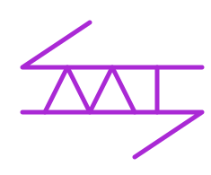

# Arona

使用 [Messaging API](https://developers.line.biz/en/docs/messaging-api/overview/)，讓 [LINE](https://line.me) 連接 [Matrix](https://matrix.org) 世界的那座橋樑。

This is the bridge for Matrix to connect with [LINE](https://line.me) via [Messaging API](https://developers.line.biz/en/docs/messaging-api/overview/).

[Bridge](https://matrix.org/bridges/) is the idea makes **[Matrix](https://matrix.org)** cross connecting every Instant Message Providers.

## Documentation

The documents and instructions is available on the GitHub wiki of this repository.

[Here](https://github.com/web-tech-tw/arona/wiki)

## Discussion

Matrix room: [`#line:matrix.org`](https://matrix.to/#/#line:matrix.org)
