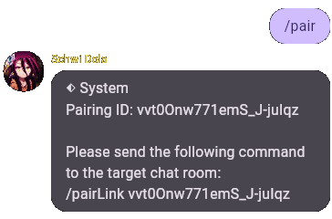

# Matrix

[Matrix](https://matrix.org) is a instant messaging protocol that allows you to communicate with other users in real-time.

Matrix is an open standard that is designed to be interoperable with other messaging platforms.

It's a decentralized network that allows you to communicate with other users on the same network.

You can use the Matrix integration to send messages to a Matrix room from your bot.


## Prerequisites

Before you can set up the Matrix integration, you need to have the following:

- A Matrix account
- A Matrix room

## Setting up the integration

To set up the Matrix integration, you need to create a Matrix room in your Matrix account. You can do this by following these steps:

1. Register a Matrix account, to be used as the bot account.
2. Fill in the `homeserverUrl` field with the homeserver URL of the Matrix API (see the [Configure](#configure) section).
3. Log in to the Matrix account via the `matrix_access.ts` script in the root folder.
4. You will get the access token from the script, fill in the `accessToken` field (see the [Configure](#configure) section).
5. Open your own Matrix application you want to use normally.
6. Create a room, and invite the bot account to the room.
7. After the bot account has joined the room, you can start sending messages to the room.
8. Start a chat with the bot and send a command to verify that it is working.

Here is the documentation of Matrix Spec: [Matrix Spec](https://spec.matrix.org/latest).



### Configure

Here are the options you can configure for the Matrix integration:

| Option                            | Description                             |
| --------------------------------- | --------------------------------------- |
| [`enable`](#enable)               | Whether the provider is enabled or not. |
| [`homeserverUrl`](#homeserverurl) | The homeserver URL of the Matrix API    |
| [`accessToken`](#accesstoken)     | The access token of the Matrix API.     |

#### `enable`

*type: `boolean`*

Whether the provider is enabled or not.

#### `homeserverUrl`

*type: `string`*

The homeserver URL of the Matrix API.

More information can be found [here](https://matrix.org/docs/guides/client-server-api).

#### `accessToken`

*type: `string`*

The access token of the Matrix API.

You should obtain this token from the `matrix_access.ts` script in the root folder.

To use the script, you need to run the following command:

```bash
npm run matrix-access
```

This will generate a new access token for you to use in the `accessToken` field.

---

> The copyright of the brand logos belongs to the respective brand owners.
